📚 Mybrary

Mybrary is a Laravel-based web application where users can register, login, and share their creative works and books. Users can also upload images, write content, and interact with other users by reading and rating their works.

---

## 🚀 Features

- 🔐 User Authentication (Register / Login / Logout)
- ✍️ Create and publish creative posts / books
- 🖼️ Upload images with content
- 📖 Read other users’ publications
- ⭐ Rate and evaluate other users’ works
- 👤 User-based content management
- 🗂️ Organized routing and controllers structure

---

## 🛠️ Tech Stack

- Laravel (PHP Framework)
- PHP
- MySQL
- Blade Templates
- HTML / CSS
- JavaScript

---
## Screenshots
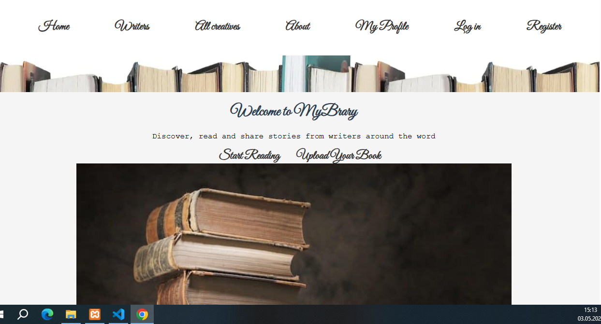
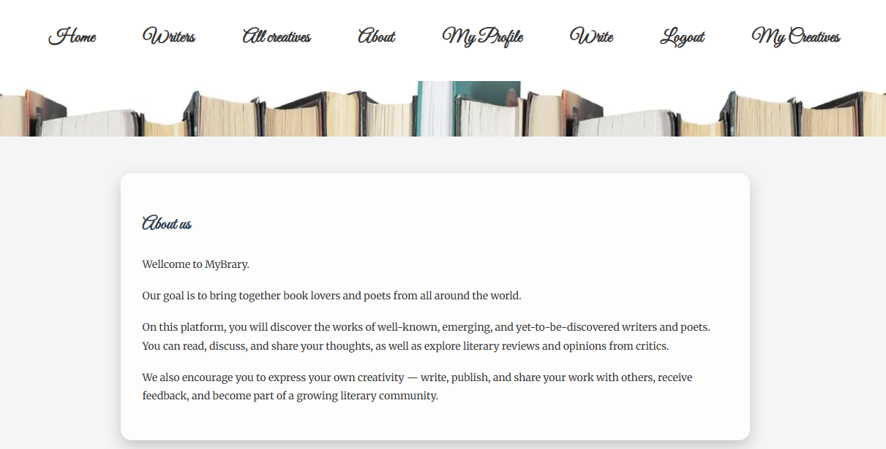
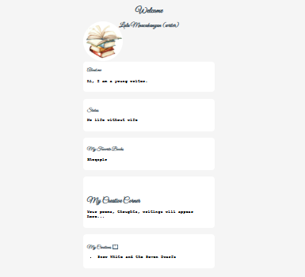

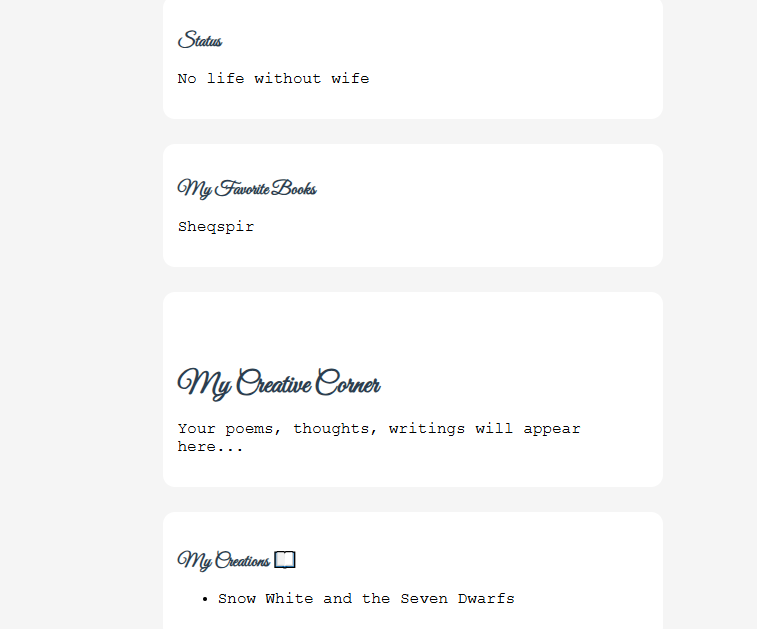

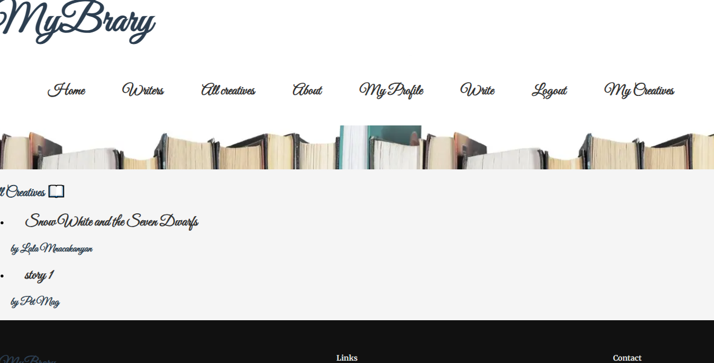
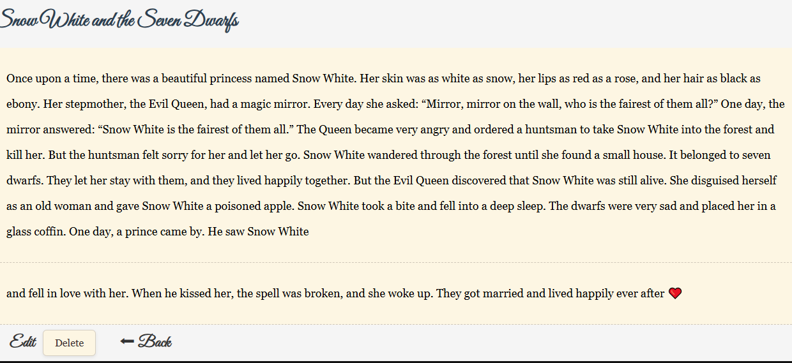
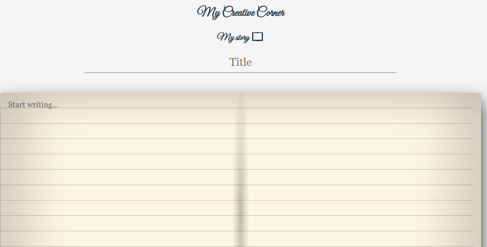
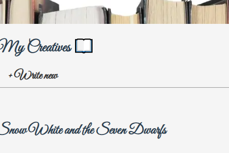
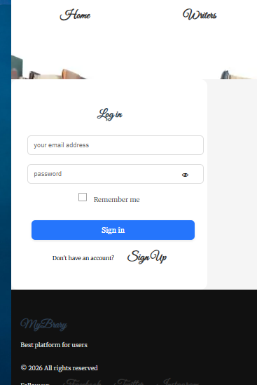
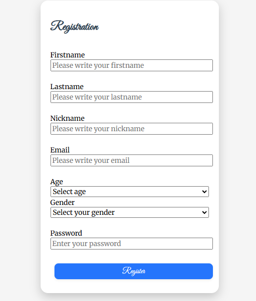
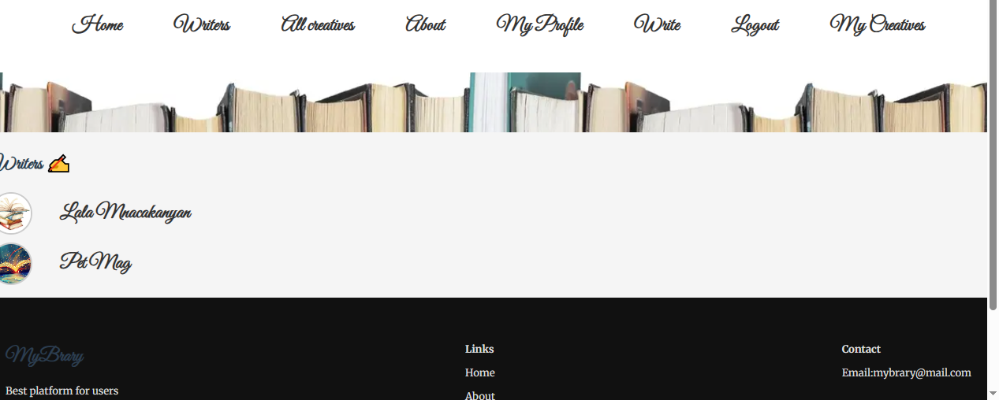
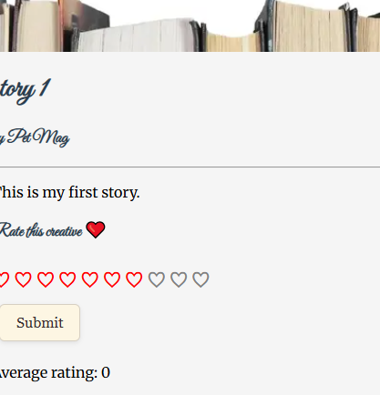
## 📦 Installation

Clone the repository:

```bash
git clone https://github.com/Magy2026/MyBrary2026.git


